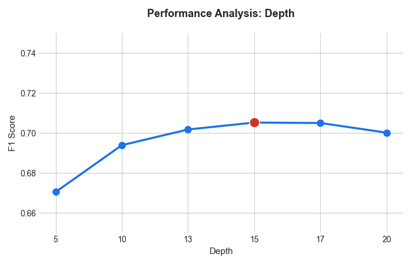
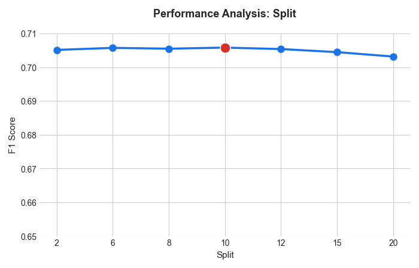
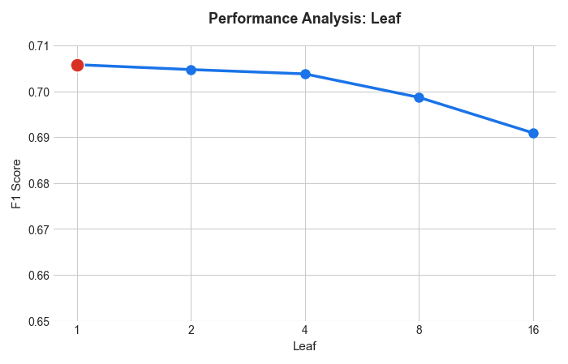

## Hyperparameter Tuning : Random Forest

### 1. Max_depth

실험 범위 : [5, 10, 13, 15, 17, 20]  
max_depth=15 지점까지 F1 score가 상승하다가 17 이상부터는 하락하는 과적합(Overfitting) 양상이 관찰됨.  
최적의 성능과 일반화의 균형점인 15 선정.

#### max_depth 변화에 따른 성능 측정
| Depth | Test F1 | Train F1 | Test AUC | 비고 |
| :--- | :---: | :---: | :---: | :--- |
| 5 | 0.6704 | 0.6732 | 0.9079 | |
| 10 | 0.6938 | 0.7184 | 0.9186 | |
| 13 | 0.7017 | 0.7552 | 0.9189 | |
| **15** | **0.7051** | **0.7861** | **0.9181** | **최적값 선정** |
| 17 | 0.7049 | 0.8208 | 0.9168 | 과적합 발생 |
| 20 | 0.7001 | 0.8682 | 0.9141 | 성능 하락 |

Depth    5: Test F1 = 0.6704 (Train F1 = 0.6732)  
Depth   10: Test F1 = 0.6938 (Train F1 = 0.7184)  
Depth   13: Test F1 = 0.7017 (Train F1 = 0.7552)  
Depth   15: Test F1 = 0.7051 (Train F1 = 0.7861)  
Depth   17: Test F1 = 0.7049 (Train F1 = 0.8208)  
Depth   20: Test F1 = 0.7001 (Train F1 = 0.8682)

### 2. Min_samples_split

max_depth=15 고정.  
실험 범위 : [2, 6, 8, 10, 12, 15, 20]  
기준을 강화했을 때 미세한 성능 향상이 있었고, 특히 10 지점에서 가장 안정적인 성능을 보임.  
10 선정.
| Split | Test F1 | Train F1 | 비고 |
| :--- | :---: | :---: | :--- |
| 2 | 0.7051 | 0.7861 | 기본값 |
| 6 | 0.7057 | 0.7729 | |
| 8 | 0.7055 | 0.7687 | |
| **10** | **0.7058** | **0.7642** | **최적값 선정** |
| 12 | 0.7054 | 0.7617 | |
| 15 | 0.7045 | 0.7567 | |
| 20 | 0.7032 | 0.7511 | |

min_samples_split 변화 (depth=15 고정)  
Split   2: Test F1 = 0.7051 (Train F1 = 0.7861)  
Split   6: Test F1 = 0.7057 (Train F1 = 0.7729)  
Split   8: Test F1 = 0.7055 (Train F1 = 0.7687)  
Split  10: Test F1 = 0.7058 (Train F1 = 0.7642)  
Split  12: Test F1 = 0.7054 (Train F1 = 0.7617)  
Split  15: Test F1 = 0.7045 (Train F1 = 0.7567)  
Split  20: Test F1 = 0.7032 (Train F1 = 0.7511)

### 3. Min_samples_leaf

max_depth=15 고정, min_samples_split=10 고정.  
실험 범위 : [1, 2, 4, 8, 16]  
값을 2 이상으로 높일 경우 모델이 지나치게 단순화되며 성능이 하락함.  
정보 손실 최소화를 위해 기본값인 1 유지.  
| Leaf | Test F1 | Train F1 | 비고 |
| :--- | :---: | :---: | :--- |
| **1** | **0.7058** | **0.7642** | **최적값 선정** |
| 2 | 0.7048 | 0.7599 | |
| 4 | 0.7038 | 0.7515 | |
| 8 | 0.6987 | 0.7356 | |
| 16 | 0.6909 | 0.7156 | 성능 급락 지점 |

min_samples_leaf 변화 (depth=15, split=10 고정)  
Leaf  1: Test F1 = 0.7058 (Train F1 = 0.7642)  
Leaf  2: Test F1 = 0.7048 (Train F1 = 0.7599)  
Leaf  4: Test F1 = 0.7038 (Train F1 = 0.7515)  
Leaf  8: Test F1 = 0.6987 (Train F1 = 0.7356)  
Leaf 16: Test F1 = 0.6909 (Train F1 = 0.7156)

### 4. 최종 모델 성능 (5-Fold CV Average)

Final F1-Score: 0.7058 ± 0.0021  
Final AUC-Score: 0.9181 ± 0.0015