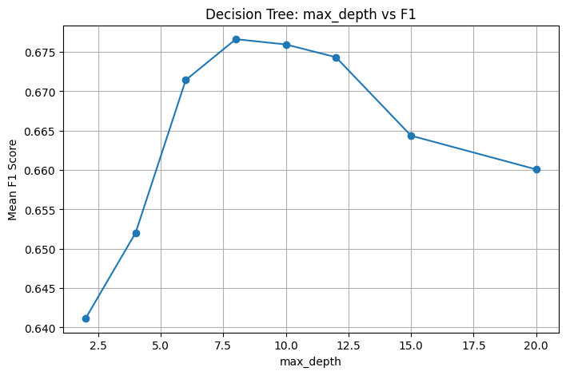
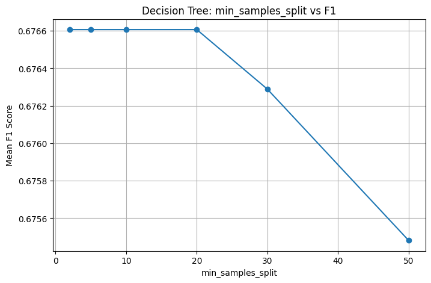
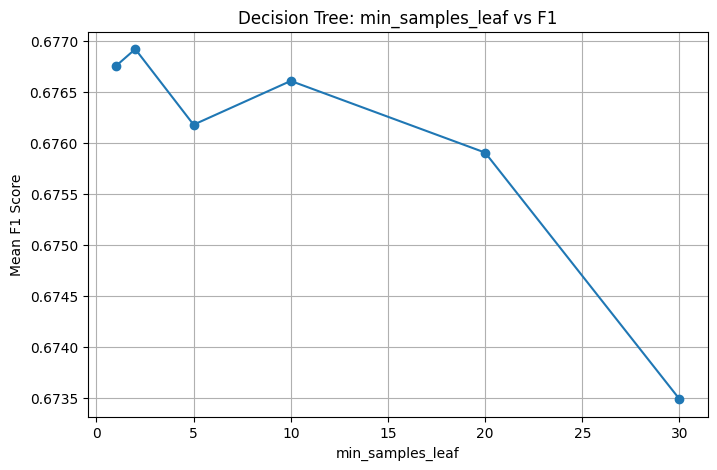

# 하이퍼 파라미터 튜닝

## 1. max_depth

- max_depth가 너무 작은 경우: 모델이 충분한 패턴을 학습하지 못해 underfitting이 발생
- max_depth가 너무 큰 경우: 과적합으로 인해 CV 성능이 감소

max_depth=8 부근에서 가장 안정적이고 높은 F1 성능을 기록하여 해당 값을 선택함.

## 2. min_samples_split

- min_samples_split이 너무 작은 경우: 작은 샘플 단위까지 과도하게 분기하여 과적합이 발생
- min_samples_split이 너무 큰 경우: 모델 표현력이 감소함.

min_samples_split=20 부근에서 가장 안정적인 성능을 보여 해당 값을 선택함.

## 3. min_samples_leaf

- min_samples_leaf를 증가시키면 leaf node에 충분한 샘플 수가 확보되어 노이즈 학습이 감소함.
- 그러나 지나치게 큰 값은 세부 패턴 학습을 제한하여 성능이 감소하게 됨.

min_samples_leaf=10에서 가장 우수한 일반화 성능을 보여 최종값으로 선택함.

## 4. criterion

- score(gini): 0.6766065501025338
- score(entropy): 0.6767864125571001
둘의 차이가 거의 없음.

gini의 계산이 entropy보다 더 단순하고, 일반적으로 entropy는 조금 더 복잡한 트리를 생성하는 경향이 있어 gini가 더 안정적이기 때문에 gini를 선택함.

## 5. class_weight
'balanced' 사용
타겟 데이터 분포가 불균형하기 때문에, 이를 처리하기 위함.