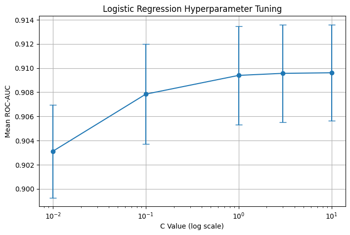

# 하이퍼 파라미터 튜닝

## 1. C

C=0.01  | AUC=0.90312 ± 0.00385
C=0.1   | AUC=0.90784 ± 0.00414
C=1     | AUC=0.90940 ± 0.00408
C=3     | AUC=0.90956 ± 0.00404
C=10    | AUC=0.90961 ± 0.00399

Best C   : 10
Best AUC : 0.90961

C=10 부근에서 가장 높은 성능을 기록하여 해당 값을 선택함.

## 2. solver=

'lbfgs' 선택함.
현재 구조:
데이터에 값이 모두 채워져 있음
One-Hot Encoding이 되어 있음
데이터 형태가 행/열 형태

현재 구조에느 lbfgs가 적합하다고 판단함.