# 1. 결측치 처리

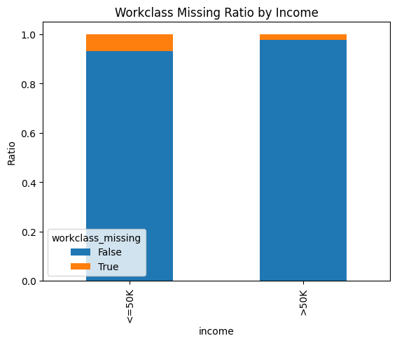
workclass와 occupation의 결측치는 랜덤하게 발생하지 않았으며, 저소득 집단(≤50K)에서 높은 비율로 나타났다.  
따라서 결측 행을 제거할 경우 저소득 샘플이 과도하게 삭제될 가능성이 존재한다.  

또한 최빈값 대체 방식은 특정 범주 비율을 과도하게 증가시켜 데이터 왜곡을 유발할 수 있다고 판단하였다.  
이에 따라 두 변수의 결측치는 `Unknown` 범주로 처리하였다.

- 전체

| income | 비율 |
|---|---|
| <=50K | 0.760858 |
| >50K | 0.239142 |

- native_country 결측 행 분포

| income | 비율 |
|---|---|
| <=50K | 0.734513 |
| >50K | 0.265487 |

native_country 결측 행의 income 분포는 전체 분포와 유사하게 나타났다.  
따라서 결측이 랜덤(MCAR)에 가깝다고 판단하였으며, 일관된 결측치 처리 기준을 유지하기 위해 `Unknown`으로 처리하였다.

---

# 2. education 제거

education과 education_num은 동일한 정보를 나타내는 변수이다.  
education_num이 education의 ordinal encoding 역할을 수행하고 있으므로, 중복 정보 제거를 위해 education 컬럼을 제거하였다.

---

# 3. capital_gain/loss 피처 엔지니어링

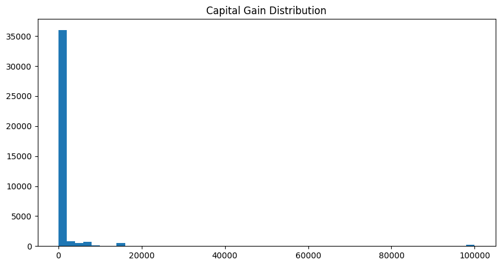
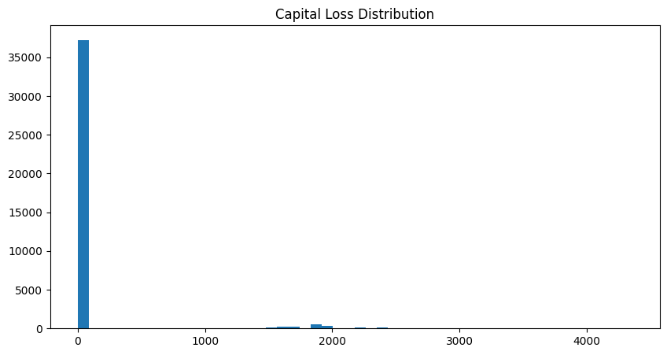

capital_gain과 capital_loss는 모두 극단적인 right-skew 분포를 보였으며, 대부분의 값이 0에 집중되어 있었다.  
두 변수 모두 90% 이상의 샘플이 0 값을 가지는 극단적 비대칭 분포를 나타냈다.

- Binary flag  
  자본 수익/손실 존재 여부만을 나타내는 파생변수를 생성하였다.  
  단순 존재 여부만으로도 고소득 집단을 구분하는 데 유의미한 정보가 될 수 있다고 판단하였다.

- Log transform  
  일부 값의 규모가 매우 크기 때문에 로그 변환을 적용하여 왜도를 완화하였다.

- Net capital  
  capital_gain과 capital_loss의 차이를 이용해 순자본(net capital) 변수를 생성하였다.  
  이를 통해 개인의 종합적인 재무 상태를 반영하고자 하였다.

---

# 4. native_country 이진화

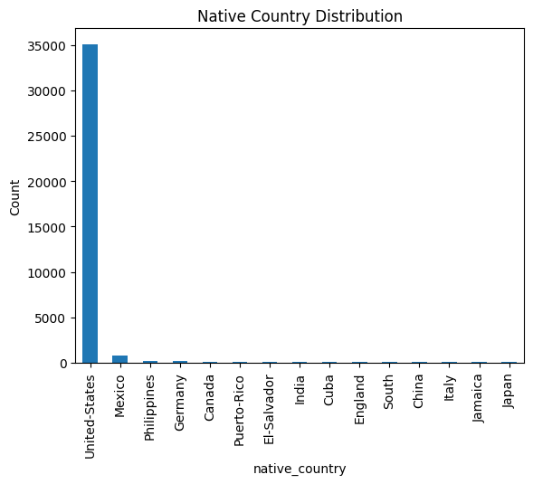
United-States의 비율이 압도적으로 높게 나타났으며, 다수 국가의 샘플 수는 매우 적은 수준이었다.  

희소 카테고리로 인한 차원 증가 및 과적합 가능성을 완화하기 위해 United-States와 Other의 이진 범주로 재구성하였다.

---

# 5. race 이진화

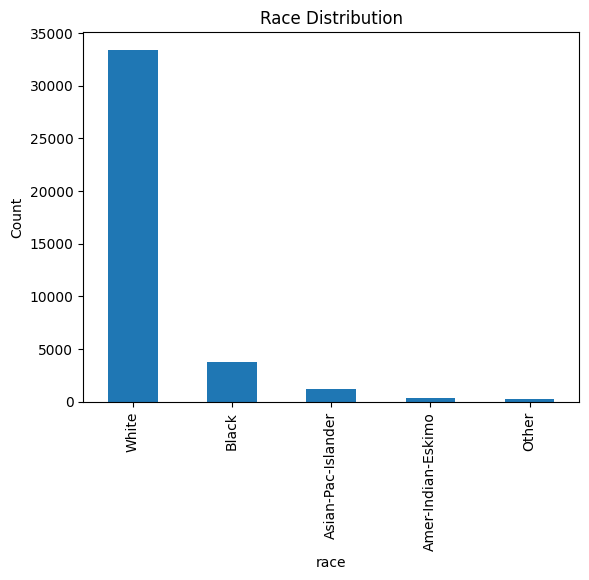

White 범주의 비율이 압도적으로 높게 나타났다.  

희소 카테고리 문제를 완화하고 범주 수를 축소하기 위해 White와 Non-white의 이진 범주로 재구성하였다.

---

# 6. workclass 그룹핑

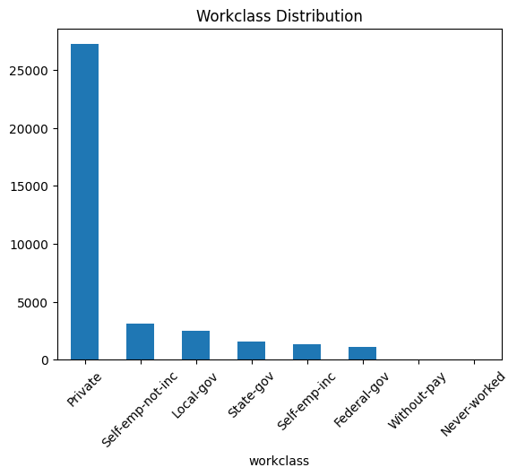

workclass 변수는 범주 수가 많고 일부 범주의 샘플 수가 매우 적게 나타났다.  

원-핫 인코딩 적용 시 차원이 크게 증가할 가능성이 존재하므로, 유사한 직군끼리 그룹화하여 희소 카테고리 문제와 차원 증가 문제를 완화하고자 하였다.  

또한 유사 직군은 비슷한 경제적 특성을 공유할 가능성이 높다고 판단하였다.

---

# 7. 추가 피처 엔지니어링

## 1. is_married

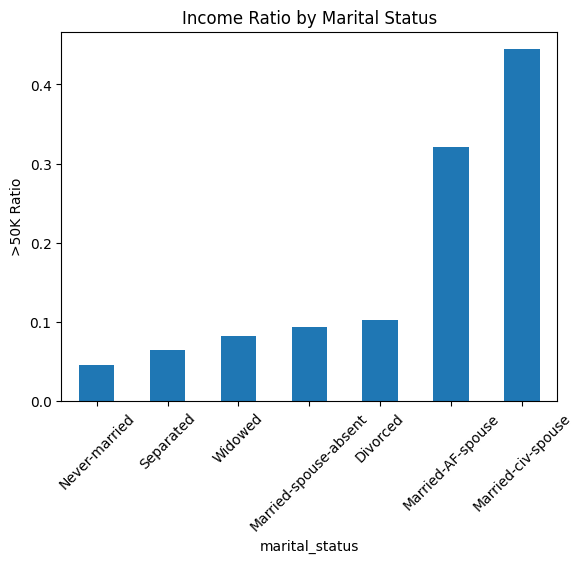

기혼 집단에서 고소득 비율이 상대적으로 높게 나타났다.  

이에 따라 혼인 여부를 단순화한 `is_married` 파생변수를 생성하였다.

---

## 2. married_male

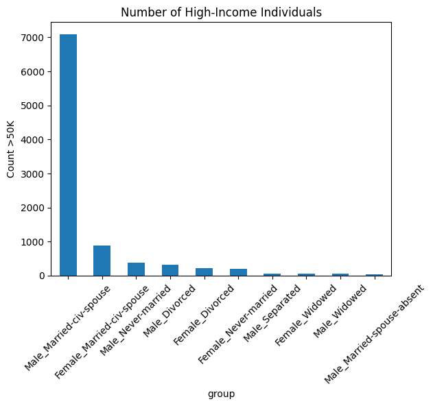

기혼 남성 집단에서 고소득 비율이 특히 높게 나타났다.  

이는 성별과 혼인 상태 간 상호작용 효과가 존재함을 의미하며, 이를 반영하기 위해 `married_male` 파생변수를 생성하였다.

---

## 3. is_spouse

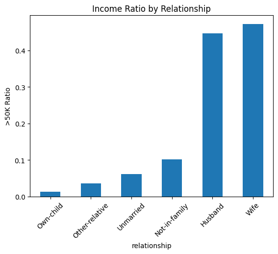

배우자 관계(Husband, Wife)를 가진 집단에서 고소득 비율이 높게 나타났다.  

이는 혼인 상태와 소득 간의 밀접한 관계를 시사한다.

---

## 4. age_squared

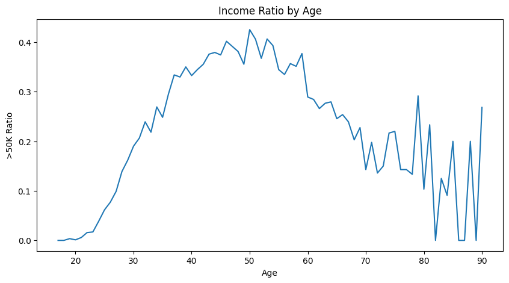

고소득 비율은 나이에 따라 단순 선형적으로 증가하지 않았으며, 중년 이후 감소하는 비선형 패턴이 관찰되었다.  

따라서 나이와 소득 간 비선형 관계를 반영하기 위해 `age^2` 파생변수를 생성하였다.

---

## 5. age_education

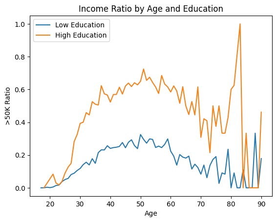

고학력 그룹은 나이가 증가할수록 고소득 비율이 더욱 빠르게 증가하는 경향을 보였다.

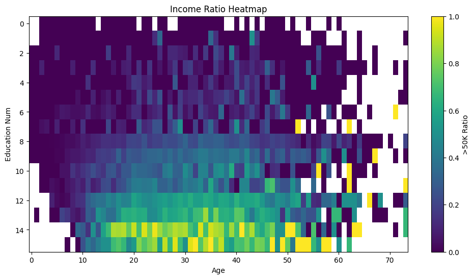

특히 고학력 + 중년 구간에서 고소득 비율이 집중되는 경향이 관찰되었다.  

이는 age와 education 간 상호작용 효과가 존재함을 의미하며, 이를 반영하기 위해 `age * education` 파생변수를 생성하였다.

---

## 6. edu_hours

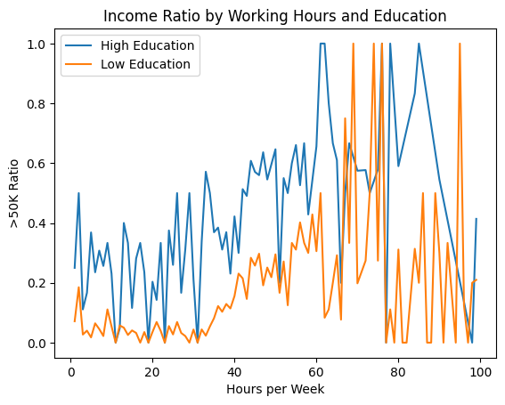

근무 시간이 증가함에 따라 고소득 비율 역시 증가하는 경향이 나타났다.  

특히 고학력 집단에서 증가 폭이 더욱 크게 나타났으며, 이는 education과 hours_per_week 간 상호작용 효과가 존재함을 시사한다.  

이에 따라 `edu_hours` 파생변수를 생성하였다.

---

## 7. overtime

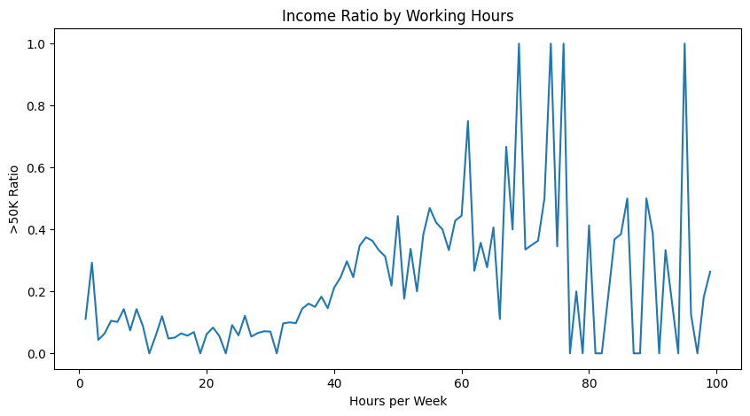

근무 시간이 증가할수록 고소득 비율이 증가하는 경향이 나타났다.  

특히 주당 40시간 이후 증가 폭이 더욱 커지는 패턴이 관찰되었다.  

이를 반영하기 위해 초과 근무 여부를 나타내는 `overtime` 변수를 생성하였다.

---

# 8. occupation 그룹핑(새로운 열로 추가)

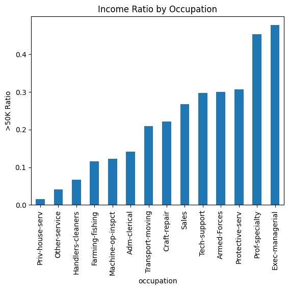

직업군별 고소득 비율 차이가 크게 나타났다.  

따라서 유사한 경제적 특성을 가지는 직군끼리 그룹화할 필요가 있다고 판단하였다.

다만 동일 그룹 내에서도 직업별 소득 차이가 크게 나타나는 경우가 존재하였다.  

이에 따라 기존 occupation 컬럼은 유지하고, occupation 그룹핑 결과를 새로운 변수로 추가하여 모델이 상황에 따라 선택적으로 활용할 수 있도록 구성하였다.